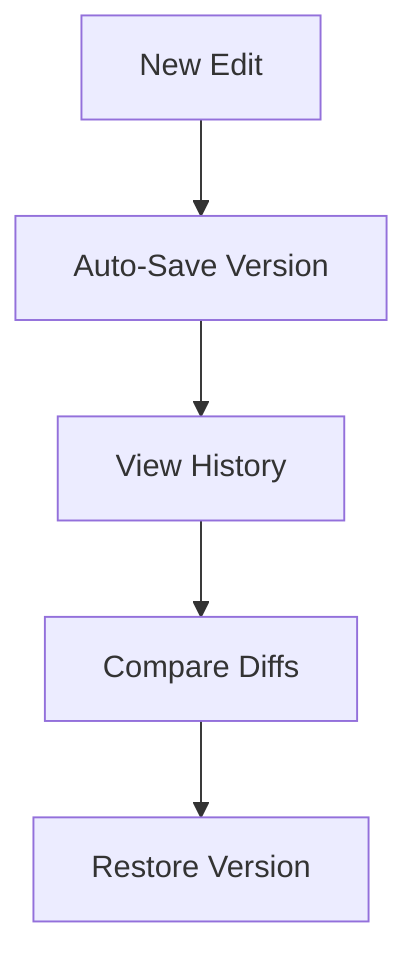

## Overview

Pragma Servizi provides a comprehensive platform for managing project documentation. You can create, edit, collaborate, and organize content efficiently. These core features help teams maintain up-to-date docs without complexity.

<Callout kind="info">
  Start with a new document to experience these features firsthand.
</Callout>

## Key Features

Discover the main capabilities through these feature cards.

<Columns cols={4}>
  <Card title="Document Creation" icon="edit-3" href="#document-creation">
    Build rich documents with Markdown and MDX support.
  </Card>
  <Card title="Version Control" icon="git-branch" href="#version-control">
    Track changes and revert with full history.
  </Card>
  <Card title="Collaboration" icon="users" href="#collaboration">
    Work together in real-time with teams.
  </Card>
  <Card title="Search & Organization" icon="search" href="#search-organization">
    Find and structure content effortlessly.
  </Card>
</Columns>

## Document Creation and Editing

Create new documents from the dashboard. You support Markdown, MDX components, and rich text editing.

<Steps>
  <Step title="Create Document" icon="plus">
    Click the `+ New Document` button.
  </Step>
  <Step title="Edit Content">
    
````markdown
# Welcome to Pragma Servizi

This is your first document.

- Use lists
- Add `code` inline
- Embed images
````

  </Step>
  <Step title="Preview & Publish" icon="eye">
    Toggle preview mode and publish.
  </Step>
</Steps>

Use frontmatter for metadata:

````yaml
---
title: My Document
description: A sample doc
---
````

## Version Control and History Tracking

Every edit creates a version. You view diffs, restore previous states, and compare changes.



<CodeGroup tabs="CLI,API">
  ````bash
  pragma versions list --doc-id=123
  pragma versions restore --version=v1.0.0
  ````

  ```javascript
  const response = await fetch('https://api.example.com/docs/123/versions');
  const versions = await response.json();
  ```
</CodeGroup>

## Collaboration Features for Teams

Invite team members and collaborate live. Features include comments, @mentions, and permissions.

<Tabs>
  <Tab title="Invite Users" icon="user-plus">
    Share a link or add emails via the members panel.
  </Tab>
  <Tab title="Real-Time Editing" icon="edit-3">
    Multiple users edit simultaneously with cursor indicators.
  </Tab>
  <Tab title="Comments" icon="message-circle">
    Add threaded comments on specific lines.
  </Tab>
</Tabs>

<Callout kind="tip">
  Use role-based access: `admin`, `editor`, `viewer`.
</Callout>

## Search and Content Organization

Search across all documents with full-text indexing. Organize using folders, tags, and navigation.

| Feature | Description | Example |
|---------|-------------|---------|
| Global Search | Query titles and content | `project setup` |
| Folders | Nest documents hierarchically | `/api/reference/` |
| Tags | Categorize for quick filtering | `#feature`, `#bugfix` |

<Expandable title="Advanced Search Syntax" default-open="false">
  Use operators like `AND`, `OR`, `"exact phrase"`.
  
  Example query: `authentication AND #api`
</Expandable>

These features ensure your documentation stays organized and accessible. Start building today.