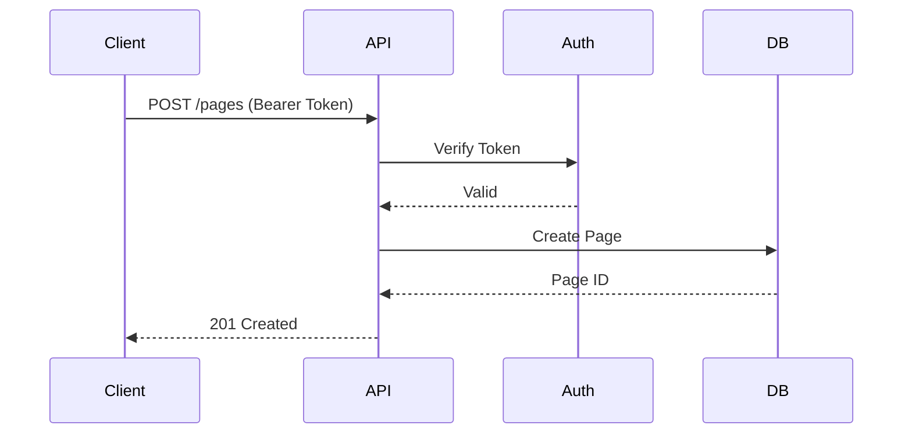

## Overview

Integrate Pragma Servizi with your favorite tools to streamline workflows, receive real-time notifications, and extend functionality. You can connect third-party apps, set up webhooks for events like page updates, export content for backups, and build custom solutions using the API.

<Callout kind="info">
  All integrations require a valid API key. Generate one in your account settings at `https://dashboard.example.com/settings/api`.
</Callout>

## Third-Party App Connections

Pragma Servizi supports seamless connections with popular tools. Use these to sync documentation, automate deployments, and collaborate efficiently.

<Columns cols={3}>
  <Card title="Slack" icon="message-circle" href="https://slack.com/apps" target="_blank">
    Send notifications for page updates and comments directly to your Slack channels.
  </Card>
  <Card title="GitHub" icon="github" href="https://github.com/apps" target="_blank">
    Sync repositories with docs for automatic version control and pull request previews.
  </Card>
  <Card title="Zapier" icon="zap" href="https://zapier.com/apps" target="_blank">
    Create no-code automations connecting Pragma Servizi to 5000+ apps.
  </Card>
</Columns>

## Webhook Setup for Notifications

Webhooks enable real-time event notifications. Configure them to trigger actions in external services when events occur, such as document publishes or user logins.

<Steps>
  <Step title="Create Webhook" icon="plus">
    Navigate to `https://dashboard.example.com/settings/webhooks` and click "New Webhook".
  </Step>
  <Step title="Configure Events" icon="settings">
    Select events like `page.updated` or `comment.created`. Enter your endpoint URL, e.g., `https://your-webhook-url.com/webhook`.
  </Step>
  <Step title="Add Secret" icon="lock">
    Generate a shared secret for signature verification.
  </Step>
  <Step title="Test and Save" icon="check-circle">
    Send a test payload and verify receipt before saving.
  </Step>
</Steps>

<Callout kind="tip">
  Always validate webhook signatures using HMAC SHA-256 with your secret to prevent unauthorized requests.
</Callout>

Example incoming webhook payload:

```json
{
  "event": "page.updated",
  "data": {
    "pageId": "doc_123abc",
    "title": "Updated Documentation",
    "url": "https://docs.example.com/page-123"
  },
  "timestamp": "2024-10-15T10:30:00Z"
}
```

## Export and Import Options

Export your documentation for backups or sharing, and import content from other formats to get started quickly.

<Tabs>
  <Tab title="Export to PDF" icon="file-text">
    From the page menu, select "Export > PDF". Choose layout options and download instantly.
    
    <Image
      src="https://example.com/export-pdf-screenshot.png"
      alt="PDF export dialog showing layout options"
      width="800"
      height="500"
    />
  </Tab>
  <Tab title="Import Markdown" icon="upload">
    Go to workspace settings > Imports. Upload `.md` files or paste GitHub URLs for automatic syncing.
    
````markdown
# Sample Markdown Import

## Heading

Content with **bold** and lists:

- Item 1
- Item 2
````
  </Tab>
</Tabs>

## API Basics for Custom Integrations

Build custom integrations using the REST API at `https://api.example.com/v1`. Authenticate with Bearer tokens.

<ParamField path="workspaceId" param-type="string" required="true">
  Your workspace identifier.
</ParamField>

<ParamField header="Authorization" param-type="string" required="true">
  Bearer `{YOUR_API_KEY}`.
</ParamField>

<CodeGroup tabs="JavaScript,cURL">
  ```javascript
  const response = await fetch('https://api.example.com/v1/pages', {
    method: 'POST',
    headers: {
      'Authorization': 'Bearer YOUR_API_KEY',
      'Content-Type': 'application/json'
    },
    body: JSON.stringify({
      title: 'New Page',
      content: '# Hello World'
    })
  });
  const data = await response.json();
  console.log(data);
  ```
  ```bash
  curl -X POST https://api.example.com/v1/pages \
    -H "Authorization: Bearer YOUR_API_KEY" \
    -H "Content-Type: application/json" \
    -d '{
      "title": "New Page",
      "content": "# Hello World"
    }'
  ```
</CodeGroup>



<Expandable title="Advanced API Rate Limits" default-open="false">
  The API enforces 100 requests per minute per token. Exceeding limits returns HTTP 429. Implement exponential backoff in your code.
</Expandable>

## Next Steps

Explore more in [Quickstart](/quickstart) or [Authentication](/authentication) pages to build robust integrations.