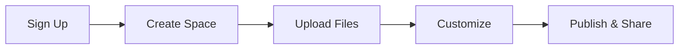

## Prerequisites

Before starting, ensure you have:

- A modern web browser (Chrome, Firefox, or Safari)
- An email address for account verification
- Optional: Node.js installed for CLI usage

<Callout kind="info">

Pragma Servizi requires account verification via email. Check your spam folder if you do not receive the confirmation link.

</Callout>

## Create and Log In to Your Account

Follow these steps to register and access your dashboard.

<Steps>
  <Step title="Visit the Dashboard" icon="monitor">
    Navigate to `https://dashboard.example.com` and click **Sign Up**.
  </Step>
  <Step title="Enter Details" icon="user">
    Provide your email, name, and a strong password. Accept the terms.
  </Step>
  <Step title="Verify Email" icon="mail">
    Check your inbox for the verification link and click it.
  </Step>
  <Step title="Log In" icon="log-in">
    Return to the dashboard, enter your credentials, and access your workspace.
  </Step>
</Steps>

## Create Your First Documentation Space

Spaces organize your project docs. Create one now.

<Steps>
  <Step title="New Space" icon="plus">
    In the dashboard, click **New Space**.
  </Step>
  <Step title="Configure Space" icon="settings">
    Enter a name like `My Project Docs`, select visibility (public/private), and choose a template.
  </Step>
  <Step title="Publish" icon="globe">
    Save and publish. Your space is live at `https://docs.example.com/my-project-docs`.
  </Step>
</Steps>

## Upload Initial Project Files

Add your Markdown files, images, or configs. Choose your preferred method.

<Tabs>
  <Tab title="Drag & Drop" icon="upload">
    In your space editor, drag files directly into the file tree. Supported: `.mdx`, `.md`, images, JSON.
  </Tab>
  <Tab title="CLI" icon="terminal">
    Use the Pragma CLI to sync files.

    <CodeGroup tabs="npm,yarn">
    ````bash
    npm install -g @pragma/cli
    pragma login --email your@email.com
    pragma space create my-project-docs
    pragma upload ./docs/* --space my-project-docs
    ````

    ````bash
    yarn global add @pragma/cli
    pragma login --email your@email.com
    pragma space create my-project-docs
    pragma upload ./docs/* --space my-project-docs
    ````
    </CodeGroup>
  </Tab>
  <Tab title="API" icon="api">
    Programmatically upload via REST API.

    <Request tabs="cURL,JavaScript">
    ````bash
    curl -X POST https://api.example.com/v1/files \
      -H "Authorization: Bearer YOUR_API_KEY" \
      -F "file=@README.md" \
      -F "space=my-project-docs"
    ````

    ````javascript
    const formData = new FormData();
    formData.append('file', fs.createReadStream('README.md'));
    formData.append('space', 'my-project-docs');

    fetch('https://api.example.com/v1/files', {
      method: 'POST',
      headers: { Authorization: 'Bearer YOUR_API_KEY' },
      body: formData
    });
    ````
    </Request>
  </Tab>
</Tabs>

<Callout kind="tip">

Start with a `README.mdx` file containing your project overview for instant structure.

</Callout>

## Customize Your Workspace

Tailor your space appearance and behavior.

<Expandable title="Theme and Layout" default-open="true">
  Go to **Space Settings > Theme**. Select colors (brand: `#3B82F6`), fonts, and sidebar layout. Preview changes live.
</Expandable>

<Expandable title="Navigation and Permissions">
  Add custom navigation links and set user roles (viewer, editor, admin).
</Expandable>

## Next Steps

Explore more features.

<Columns cols={3}>
  <Card title="Authentication" icon="shield" href="/authentication">
    Secure your spaces with API keys and SSO.
  </Card>
  <Card title="Advanced Guides" icon="book-open" href="/guides">
    Build complex docs with components.
  </Card>
  <Card title="API Reference" icon="api" href="/api">
    Automate with full REST endpoints.
  </Card>
</Columns>



Your Pragma Servizi space is ready. Build, collaborate, and document efficiently.